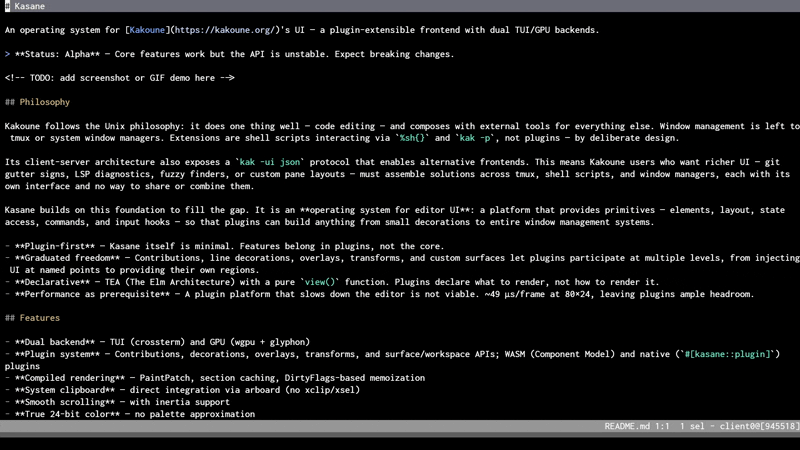

# Kasane

Drop-in Kakoune frontend with independent rendering, GPU backend, and WASM plugins.

<p align="center">
  <br>
  <sub>Fuzzy finder, pane splits, and color preview are WASM plugins — no code in Kasane itself</sub>
</p>

[](https://github.com/Yus314/kasane/actions/workflows/ci.yml)
[](LICENSE-MIT)
[](https://www.rust-lang.org)

[Getting Started](docs/getting-started.md) · [What's Different](docs/whats-different.md) · [Configuration](docs/config.md) · [Using Plugins](docs/using-plugins.md) · [Plugin Development](docs/plugin-development.md) · [Plugin API](docs/plugin-api.md) · [Vision](docs/vision.md)

## What You Get

Kakoune's `-ui json` protocol was designed to let external processes
drive the UI, but its built-in terminal renderer leaves that potential
untapped. Kasane rebuilds the rendering pipeline from scratch and opens
it to plugins.

Your kakrc works unchanged. `alias kak=kasane` and these improvements
apply automatically:

- **Flicker-free rendering** — independent pipeline at ~59 μs per frame
- **Multi-pane without tmux** — native splits with per-pane status bars
- **Clipboard that just works** — Wayland, X11, macOS, SSH forwarding
- **Correct Unicode** — independent width calculation, CJK and emoji handled

Opt in to smooth scrolling, GPU backend (`--ui gui`), themes, border
styles, and search dropdown. Existing Kakoune plugins (kak-lsp, …)
work as before. See [What's Different](docs/whats-different.md) for
the full list.

## Quick Start

> [!NOTE]
> Requires [Kakoune](https://kakoune.org/) 2024.12.09 or later.
> Binary packages skip the Rust toolchain requirement.

Arch Linux: `yay -S kasane-bin`
· macOS: `brew install Yus314/kasane/kasane`
· Nix: `nix run github:Yus314/kasane`
· From source: `cargo install --path kasane`

```bash
kasane file.txt               # your Kakoune config works unchanged
alias kak=kasane              # add to .bashrc / .zshrc
```

GPU backend: `cargo install --path kasane --features gui`, then
`kasane --ui gui`.

See [Getting Started](docs/getting-started.md) for detailed setup.

## Plugins

Kakoune's `-ui json` protocol decouples editor from renderer. Kasane
builds on this with a plugin system that opens the full UI to extension —
floating overlays, line annotations, virtual text, code folding, gutter
decorations, input handling, scroll policies, and session management.

The repository includes [example plugins](examples/wasm/) you can
try today:

| Plugin | What it does |
|---|---|
| [cursor-line](examples/wasm/cursor-line/) | Highlight the active line with theme-aware colors |
| [fuzzy-finder](examples/wasm/fuzzy-finder/) | fzf-powered file picker as a floating overlay |
| [sel-badge](examples/wasm/sel-badge/) | Show selection count in the status bar |
| [color-preview](examples/wasm/color-preview/) | Inline color swatches next to hex values |
| [pane-manager](examples/wasm/pane-manager/) | Tmux-like splits with Ctrl+W — no external multiplexer needed |
| [image-preview](examples/wasm/image-preview/) | Display images in a floating overlay anchored to the cursor |
| [smooth-scroll](examples/wasm/smooth-scroll/) | Animated scrolling |
| [prompt-highlight](examples/wasm/prompt-highlight/) | Visual feedback when entering prompt mode |

Each plugin builds into a single `.kpk` package — sandboxed, composable,
and ready to install. A complete plugin in 15 lines — here is sel-badge in its
entirety:

```rust
kasane_plugin_sdk::define_plugin! {
    manifest: "kasane-plugin.toml",

    state {
        #[bind(host_state::get_cursor_count(), on: dirty::BUFFER)]
        cursor_count: u32 = 0,
    },

    slots {
        STATUS_RIGHT(dirty::BUFFER) => |_ctx| {
            (state.cursor_count > 1).then(|| {
                auto_contribution(text(&format!(" {} sel ", state.cursor_count), default_face()))
            })
        },
    },
}
```

Start writing your own:

```bash
kasane plugin new my-plugin    # scaffold from 6 templates
kasane plugin dev              # hot-reload while you edit
```

See [Plugin Development](docs/plugin-development.md) and
[Plugin API](docs/plugin-api.md).

## Status

Kasane is stable as a Kakoune frontend — `alias kak=kasane` and use it
daily. The plugin API is still evolving; expect breaking changes if
you write plugins. The current WASM plugin ABI is `kasane:plugin@0.25.0`;
plugins built against an older ABI must be rebuilt before they will load.
If you are upgrading a plugin from ABI 0.24.0, see
[Plugin Development: Migrating to ABI 0.25.0](docs/plugin-development.md#migrating-to-abi-0250).

## Usage

```
kasane [options] [kak-options] [file]... [+<line>[:<col>]|+:]
```

All Kakoune arguments work — `kasane` passes them through to `kak`.

```bash
kasane file.txt              # Edit a file
kasane -c project            # Connect to existing session
kasane -s myses file.txt     # Named session
kasane --ui gui file.txt     # GPU backend
kasane -l                    # List sessions (delegates to kak)
```

Configuration lives in `~/.config/kasane/config.toml`:

```toml
[ui]
border_style = "rounded"   # single | rounded | double | heavy | ascii

[scroll]
smooth = true              # enable smooth scrolling (via plugin)

[search]
dropdown = true            # vertical dropdown instead of inline
```

See [docs/config.md](docs/config.md) for the full reference.

## Contributing

See [CONTRIBUTING.md](CONTRIBUTING.md) for development setup and guidelines.

```bash
cargo test                             # Run all tests
cargo clippy -- -D warnings            # Lint
cargo fmt --check                      # Format check
```

## License

MIT OR Apache-2.0
